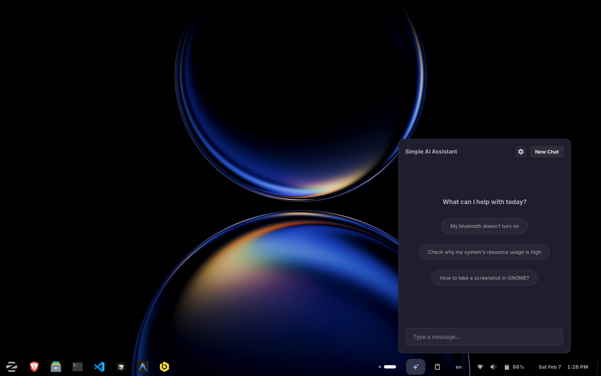
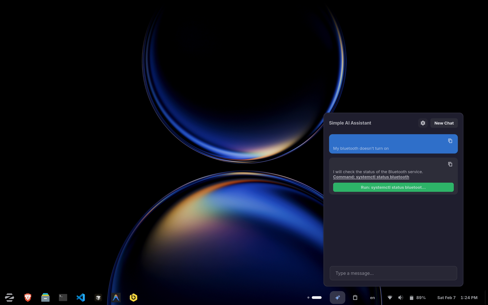

# Simple AI Assistant

A light-weight, private agentic AI assistant for GNOME Shell. Get things done with terminal command support and local system context.

## 🌟 Features

- **Agentic Loop**: AI can propose commands, see output, and continue the task.
- **Secure & Private**: API keys are **encrypted** in the GNOME Keyring. No data is sent to anyone but your chosen AI provider.
- **System Awareness**: Optionally share system details (CPU, GPU, RAM, OS) for better technical assistance.
- **Theme Support**: Automatically matches your system theme (Light/Dark).
- **History Management**: Local history storage with configurable message limits.

## 📸 Screenshots


_New Chat interface with AI provider selection_


_Agentic command execution with terminal output_

## 🛠 Prerequisites

- GNOME Shell 45+
- API Key for OpenAI, Google Gemini, or Anthropic Claude

## 🚀 Installation

1. Clone or download this repository.
2. Copy the folder to your local extensions directory:
    ```bash
    cp -r . ~/.local/share/gnome-shell/extensions/simple-ai-assistant@momen.codes
    ```
3. Compile the settings schema:
    ```bash
    glib-compile-schemas ~/.local/share/gnome-shell/extensions/simple-ai-assistant@momen.codes/schemas/
    ```
4. Restart GNOME Shell (Alt+F2 + `r` on X11, or Log out/Log in on Wayland).
5. Enable the extension using GNOME Extensions app.

## 📝 Privacy Disclosure

**Simple AI Assistant** is designed with privacy and security in mind:

- **API Keys**: Stored in your system's secure **GNOME Keyring (libsecret)**.
- **Data**: All data stays on your machine. Chat history is stored locally in `~/.cache/simple-ai-assistant/`.
- **Telemetry**: No tracking or analytics code is included.

## 👨‍💻 Credits

Developed by **Momen Elkhalifa** ([momen.codes](https://momen.codes)).
